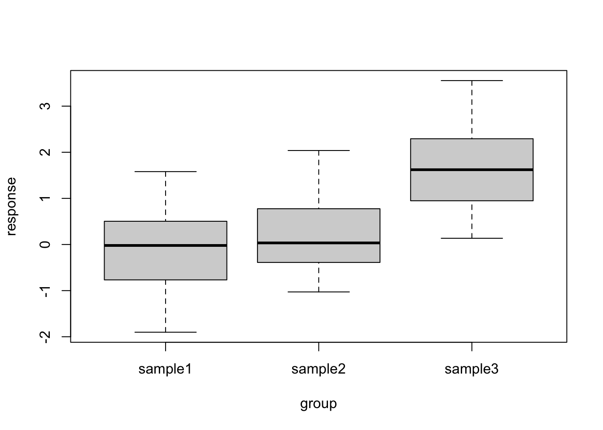
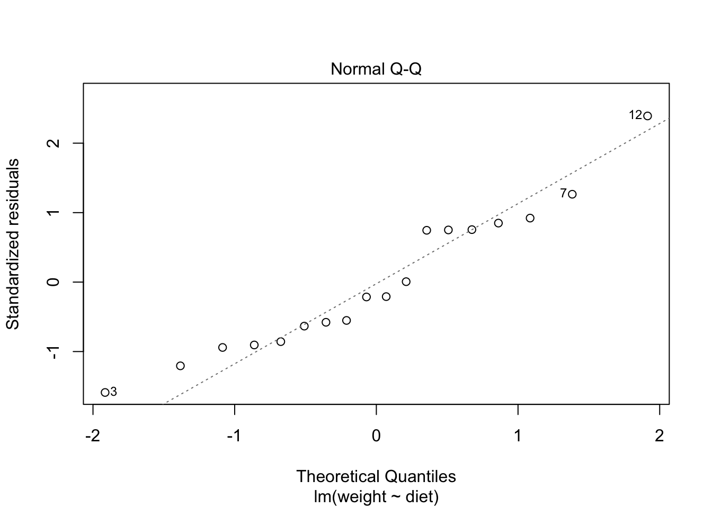
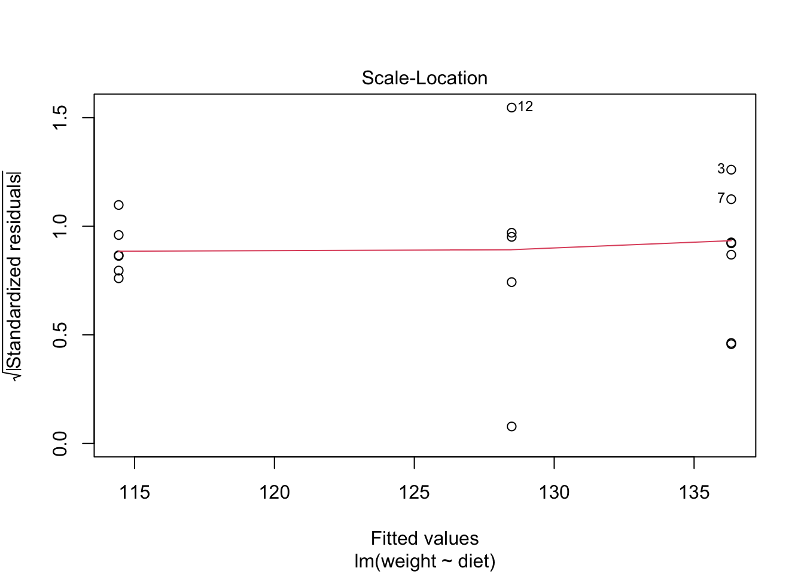

# ANOVA {#cs2-anova}

## Objectives
:::objectives
**Questions**

- How do I...
- What do I...

**Objectives**

- Be able to...
- Use...
:::

## Purpose and aim
Analysis of variance or ANOVA is a test than can be used when we have multiple samples of continuous data. Whilst it is possible to use ANOVA with only two samples, it is generally used when we have three or more groups. It is used to find out if the samples came from parent distributions with the same mean. It can be thought of as a generalisation of the two-sample Student’s t-test.

## Section commands
New commands used in this section.

| Function| Description|
|:- |:- |
|`lm()`| Fits a linear model |
|`anova()`| Carries out an ANOVA on a linear model |

## Data and hypotheses
For example, suppose we measure the feeding rate of oyster catchers (shellfish per hour) at three sites characterised by their degree of shelter from the wind, imaginatively called `exposed` (E), `partially sheltered` (P) and `sheltered` (S). We want to test whether the data support the hypothesis that feeding rates don’t differ between locations. We form the following null and alternative hypotheses:

-	$H_0$: The mean feeding rates at all three sites is the same $\mu E = \mu P = \mu S$
-	$H_1$: The mean feeding rates are not all equal.

We will use a one-way ANOVA test to check this.

-	We use a **one-way** ANOVA test because we only have one predictor variable (the categorical variable location).
-	We’re using **ANOVA** because we have more than two groups and we don’t know any better yet with respect to the exact assumptions.

The data are stored in the file `CS2-oystercatcher.csv`.

## Summarise and visualise
First we read in the data.


```r
oystercatcher <- read.csv("data/raw/CS2-oystercatcher.csv")
```

Next we summarise the data and visualise them. We have a quick peek at the first few rows of our data with `head()` so we can see how the data are organised.

The data are in stacked format. The first column contains information on feeding rates and is called `feeding.` The second column has categorical data on the type of site and is called `site`.


```r
head(oystercatcher)
```

```
##   feeding    site
## 1    14.2 Exposed
## 2    16.5 Exposed
## 3     9.3 Exposed
## 4    15.1 Exposed
## 5    13.4 Exposed
## 6    18.4 Partial
```

```r
aggregate(feeding ~ site, data = oystercatcher, summary)
```

```
##        site feeding.Min. feeding.1st Qu. feeding.Median feeding.Mean
## 1   Exposed         9.30           13.40          14.20        13.70
## 2   Partial        13.00           16.50          17.40        17.14
## 3 Sheltered        21.50           22.20          24.10        23.64
##   feeding.3rd Qu. feeding.Max.
## 1           15.10        16.50
## 2           18.40        20.40
## 3           25.10        25.30
```

```r
boxplot(feeding ~ site, data = oystercatcher)
```


Looking at the data, there appears to be a noticeable difference in feeding rates between the three sites. We would probably expect a reasonably significant statistical result here.

## Implement test
Perform an ANOVA test on the data:


```r
lm_oystercatcher <- lm(feeding ~ site, data = oystercatcher)

anova(lm_oystercatcher)
```

The first line fits a linear model to the data (i.e. finds the means of the three groups and calculates a load of intermediary data that we need for the statistical analysis) and stores this information in an R object (which I’ve called `lm_oystercatchers`, but which you can call what you like). The second line actually carries out the ANOVA analysis.

-	The first argument must be in the formula format: `response ~ predictor`
-	If the data are stored in stacked format, then the second argument must be the name of the data frame
-	The `anova()` command takes a linear model object as its main argument

## Interpret output and report results
This is the output that you should now see in the console window:


```
## Analysis of Variance Table
## 
## Response: feeding
##           Df  Sum Sq Mean Sq F value    Pr(>F)    
## site       2 254.812 127.406  21.508 0.0001077 ***
## Residuals 12  71.084   5.924                      
## ---
## Signif. codes:  0 '***' 0.001 '**' 0.01 '*' 0.05 '.' 0.1 ' ' 1
```

-	The 1st line just tells you the that this is an ANOVA test
-	The 2nd line tells you what the response variable is (in this case feeding)
-	The 3rd, 4th and 5th lines are an ANOVA table which contain some useful values:
    - The `Df` column contains the degrees of freedom values on each row, 2 and 12 (which we’ll need for the reporting)
    - The `F` value column contains the F statistic, 21.508 (which again we’ll need for reporting).
    - The p-value is 0.0001077 and is the number directly under the `Pr(>F)` on the 4th line.
    - The other values in the table (in the `Sum Sq` and `Mean Sq`) columns are used to calculate the F statistic itself and we don’t need to know these.
-	The 6th line has some symbolic codes to represent how big (small) the p-value is; so, a p-value smaller than 0.001 would have a *** symbol next to it (which ours does). Whereas if the p-value was between 0.01 and 0.05 then there would simply be a * character next to it, etc. Thankfully we can all cope with actual numbers and don’t need a short-hand code to determine the reporting of our experiments (please tell me that’s true…!)

Again, the p-value is what we’re most interested in here and shows us the probability of getting samples such as ours if the null hypothesis were actually true.

Since the p-value is very small (much smaller than the standard significance level of 0.05) we can say "that it is very unlikely that these three samples came from the same parent distribution" and as such we can reject our null hypothesis and state that:

> A one-way ANOVA showed that the mean feeding rate of oystercatchers differed significantly between locations (F = 21.51, df = 2, 12, p = 0.00011).

Note that we have included (in brackets) information on the test statistic (F = 21.51), both degrees of freedom (df = 2, 12), and the p-value (p = 0.00011).

## Assumptions
To use an ANOVA test, we have to make three assumptions:

1.	The parent distributions from which the samples are taken are normally distributed
2.	Each data point in the samples is independent of the others
3.	The parent distributions should have the same variance

In a similar way to the two-sample tests we will consider the normality and equality of variance assumptions both using tests and by graphical inspection (and ignore the independence assumption).

**1. Normality**

Unstack the data and perform a Shapiro-Wilk test on each group separately.


```r
uns_oyster <- unstack(oystercatcher)

shapiro.test(uns_oyster$Exposed)
shapiro.test(uns_oyster$Partial)
shapiro.test(uns_oyster$Sheltered)
```

This is the output that you should now see in the console window:


```
## 
## 	Shapiro-Wilk normality test
## 
## data:  uns_oyster$Exposed
## W = 0.9151, p-value = 0.4988
```

```
## 
## 	Shapiro-Wilk normality test
## 
## data:  uns_oyster$Partial
## W = 0.96913, p-value = 0.8697
```

```
## 
## 	Shapiro-Wilk normality test
## 
## data:  uns_oyster$Sheltered
## W = 0.88532, p-value = 0.3341
```

We can see that all three groups appear to be normally distributed which is good.

For ANOVA however, considering each group in turn is often considered quite excessive and, in most cases, it is sufficient to consider the normality of the combined set of _residuals_ from the data. We’ll explain residuals properly in the [next session](#cs3-intro) but effectively they are the difference between each data point and its group mean. The residuals can be obtained directly from the linear model we fitted earlier.

Extract the residuals from the data and check their normality:


```r
resid_oyster <- residuals(lm_oystercatcher)

shapiro.test(resid_oyster)
```

```
## 
## 	Shapiro-Wilk normality test
## 
## data:  resid_oyster
## W = 0.93592, p-value = 0.3338
```
Again, we can see that the combined residuals from all three groups appear to be normally distributed (which is as we would have expected given that they were all normally distributed individually!)

**2. Equality of Variance**

We now test for equality of variance using Bartlett’s test (since we’ve just found that all of the individual groups are normally distributed).

Perform Bartlett’s test on the data:


```r
bartlett.test(feeding ~ site, data = oystercatcher)
```

```
## 
## 	Bartlett test of homogeneity of variances
## 
## data:  feeding by site
## Bartlett's K-squared = 0.90632, df = 2, p-value = 0.6356
```

Where the relevant p-value is given on the 3rd line. Here we see that each group do appear to have the same variance.

**3. Graphical Interpretation and Diagnostic Plots**

R provides a convenient set of graphs that allow us to assess these assumptions graphically. If we simply ask R to plot the `lm` object we have created, then we can see some of these _diagnostic plots_.

Create the standard set diagnostic plots:


```r
# create a neat 2x2 window
par(mfrow = c(2,2))
# create the diagnostic plots
plot(lm_oystercatcher)
```

```r
# and return the window back to normal
par(mfrow = c(1,1))
```


```
## hat values (leverages) are all = 0.2
##  and there are no factor predictors; no plot no. 5
```


The second line creates the three diagnostic plots (it actually tries to create four plots but can’t do that for this dataset so you’ll also see some warning text output to the screen (something about hat values). I’ll go through this in the next session where it’s easier to explain).

-	In this example, two of the plots (top-left and bottom-left) show effectively the same thing: what the distribution of data between each group look like. These allow an informal check on the equality of variance assumption.
    - For the top-left graph we want all data to be symmetric about the 0 horizontal line and for the spread to be the same (please ignore the red line; it is an unhelpful addition to these graphs).
    - For the bottom-left graph, we will look at the red line as we want it to be approximately horizontal.
- The top-right graph is a familiar Q-Q plot that we used previously to assess normality, and this looks at the combined residuals from all of the groups (in much the same way as we looked at the Shapiro-Wilk test on the combined residuals).

We can see that these graphs are very much in line with what we’ve just looked at using the test, which is reassuring. The groups all appear to have the same spread of data, and whilst the QQ-plot isn’t perfect, it appears that the assumption of normality is allright.

:::note
At this stage, I should point out that I nearly always stick with the graphical method for assessing the assumptions of a test. Assumptions are rarely either completely met or not met and there is always some degree of personal assessment.

Whilst the formal statistical tests (like Shapiro) are technically fine, they can often create a false sense of things being absolutely right or wrong in spite of the fact that they themselves are still probabilistic statistical tests. In these exercises we are using both approaches whilst you gain confidence and experience in interpreting the graphical output and whilst it is absolutely fine to use both in the future I would strongly recommend that you don’t rely solely on the statistical tests in isolation.
:::

## Post-hoc testing
One drawback with using an ANOVA test is that it only tests to see if all of the means are the same, and if we get a significant result using ANOVA then all we can say is that not all of the means are the same, rather than anything about how the pairs of groups differ. For example, consider the following boxplot for three samples.



Each group is a random sample of 20 points from a normal distribution with variance 1. Groups 1 and 2 come from a parent population with mean 0 whereas group 3 come from a parent population with mean 2. The data clearly satisfy the assumptions of an ANOVA test.

**1. Read in the data and plot**


```r
tukey <- read.csv("data/raw/CS2-tukey.csv")
boxplot(response ~ group, data = tukey)
```

**2. Test for a significant difference in group means**


```r
lm_tukey <- lm(response ~ group, data = tukey)

anova(lm_tukey)
```

```
## Analysis of Variance Table
## 
## Response: response
##           Df Sum Sq Mean Sq F value    Pr(>F)    
## group      2 33.850 16.9250   20.16 2.392e-07 ***
## Residuals 57 47.854  0.8395                      
## ---
## Signif. codes:  0 '***' 0.001 '**' 0.01 '*' 0.05 '.' 0.1 ' ' 1
```
Here we have a p-value of 2.39x10<sup>-7</sup> and so the test has very conclusively rejected the hypothesis that all means are equal.

However, this was not due to all of the sample means being different, but rather just because one of the groups is very different from the others. In order to drill down and investigate this further we use a new test called **Tukey’s range test** (or **Tukey’s honest significant difference test** – this always makes me think of some terrible cowboy/western dialogue). This will compare all of the groups in a pairwise fashion and reports on whether a significant difference exists.

**3. Performing Tukey’s test on these data**


```r
aov_tukey <- aov(response ~ group, data = tukey)

TukeyHSD(aov_tukey)
```

```
##   Tukey multiple comparisons of means
##     95% family-wise confidence level
## 
## Fit: aov(formula = response ~ group, data = tukey)
## 
## $group
##                      diff        lwr      upr     p adj
## sample2-sample1 0.3037563 -0.3934982 1.001011 0.5498005
## sample3-sample1 1.7233591  1.0261047 2.420614 0.0000005
## sample3-sample2 1.4196028  0.7223484 2.116857 0.0000246
```

The first argument repeats our ANOVA using a different function 'aov()'. We store the output of this function in an R object called `aov_tukey`.
Note that the `TukeyHSD()` function takes the output of the `aov()` function as its argument and not the raw data.

The bottom three lines contain the information that we want. The final column of each (entitled `p adj`) is the p-value that we’re looking for. The null hypothesis in each case is that there is no difference in the mean between the two groups. As we can see the first line shows that there isn’t a significant difference between `sample1` and `sample2` but the 2nd and 3rd lines show that there is a significant difference between `sample1` and `sample3`, as well as `sample2` and `sample3`. This matches with what we expected based on the boxplot.

**4. Assumptions**

When to use Tukey’s range test is a matter of debate (strangely enough a lot of statistical analysis techniques are currently matters of opinion rather than mathematical fact – it does explain a little why this whole field appears so bloody confusing!)

-	Some people claim that we should only perform Tukey’s range test (or any other post-hoc tests) if the preceding ANOVA test showed that there was a significant difference between the groups and that if the ANOVA test had not shown any significant differences between groups then we would have to stop there.
-	Other people say that this is rubbish and we can do what the hell we like, when we like as long as we tell people what we did.

The background to this is rather involved but one of the reasons for this debate is to prevent so-called **data-dredging** or **p-hacking**. This is where scientists/analysts are so fixated on getting a "significant" result that they perform a huge variety of statistical techniques until they find one that shows that their data is significant (this was a particular problem in psychological studies for while – not to point fingers though, they are working hard to sort their stuff out. Kudos!).

Whether you should use post-hoc testing or not will depend on your experimental design and the questions that you’re attempting to answer.

Tukey’s range test, when we decide to use it, requires the same three assumptions as an ANOVA test:

1.	Normality of distributions
2.	Equality of variance between groups
3.	Independence of observations


## Exercise
:::exercise
Juvenile lobster weight

Juvenile lobsters in aquaculture were grown on three different diets (fresh mussels, semi-dry pellets and dry flakes). After nine weeks, their wet weight was:

<table class="table table-striped table-condensed" style="width: auto !important; margin-left: auto; margin-right: auto;">
 <thead>
  <tr>
   <th style="text-align:right;background-color: white !important;"> Mussels </th>
   <th style="text-align:right;background-color: white !important;"> Pellets </th>
   <th style="text-align:right;background-color: white !important;"> Flakes </th>
  </tr>
 </thead>
<tbody>
  <tr>
   <td style="text-align:right;background-color: white !important;"> 151.6 </td>
   <td style="text-align:right;background-color: white !important;"> 117.7 </td>
   <td style="text-align:right;background-color: white !important;"> 101.8 </td>
  </tr>
  <tr>
   <td style="text-align:right;background-color: white !important;"> 132.1 </td>
   <td style="text-align:right;background-color: white !important;"> 110.8 </td>
   <td style="text-align:right;background-color: white !important;"> 102.9 </td>
  </tr>
  <tr>
   <td style="text-align:right;background-color: white !important;"> 104.2 </td>
   <td style="text-align:right;background-color: white !important;"> 128.6 </td>
   <td style="text-align:right;background-color: white !important;"> 90.4 </td>
  </tr>
  <tr>
   <td style="text-align:right;background-color: white !important;"> 153.5 </td>
   <td style="text-align:right;background-color: white !important;"> 110.1 </td>
   <td style="text-align:right;background-color: white !important;"> 132.8 </td>
  </tr>
  <tr>
   <td style="text-align:right;background-color: white !important;"> 132.0 </td>
   <td style="text-align:right;background-color: white !important;"> 175.2 </td>
   <td style="text-align:right;background-color: white !important;"> 129.3 </td>
  </tr>
  <tr>
   <td style="text-align:right;background-color: white !important;"> 119.0 </td>
   <td style="text-align:right;background-color: white !important;"> NA </td>
   <td style="text-align:right;background-color: white !important;"> 129.4 </td>
  </tr>
  <tr>
   <td style="text-align:right;background-color: white !important;"> 161.9 </td>
   <td style="text-align:right;background-color: white !important;"> NA </td>
   <td style="text-align:right;background-color: white !important;"> NA </td>
  </tr>
</tbody>
</table>

Is there any evidence that diet affects the growth rate of lobsters?

1.	Write down the null and alternative hypotheses
2.	Import the data into R
    - The data are stored in the file `data/raw/CS2-lobsters.csv`
3. Summarise and visualise the data
4. Check the assumptions using appropriate tests and graphical analyses
5. Perform an ANOVA test
6. Write down a sentence that summarise the results that you have found
7. Perform a post-hoc test and report the findings

<details><summary>Answer</summary>

**1. Hypotheses**

$H_0$ : all means are equal

$H_1$ : not all means are equal

**2-3. Import Data, summarise and visualise**

The data are stored in a `.csv` file in stacked format with columns called `weight` and `diet`.


```r
lobsters <- read.csv("data/raw/CS2-lobsters.csv")
```

Let's look at the data and see what we can see.


```
##    weight    diet
## 1   151.6 Mussels
## 2   132.1 Mussels
## 3   104.2 Mussels
## 4   153.5 Mussels
## 5   132.0 Mussels
## 6   119.0 Mussels
## 7   161.9 Mussels
## 8   117.7 Pellets
## 9   110.8 Pellets
## 10  128.6 Pellets
## 11  110.1 Pellets
## 12  175.2 Pellets
## 13  101.8  Flakes
## 14  102.9  Flakes
## 15   90.4  Flakes
## 16  132.8  Flakes
## 17  129.3  Flakes
## 18  129.4  Flakes
```


```r
aggregate(weight ~ diet, data = lobsters, summary)
```

```
##      diet weight.Min. weight.1st Qu. weight.Median weight.Mean weight.3rd Qu.
## 1  Flakes     90.4000       102.0750      116.1000    114.4333       129.3750
## 2 Mussels    104.2000       125.5000      132.1000    136.3286       152.5500
## 3 Pellets    110.1000       110.8000      117.7000    128.4800       128.6000
##   weight.Max.
## 1    132.8000
## 2    161.9000
## 3    175.2000
```

```r
boxplot(weight ~ diet, data = lobsters)
```


As always we use the plot and summary to assess three things:

1. Did we load the data in properly?
  * We see three groups with reasonable values. There aren't any data points that are obviously wrong (negative, zero or massively big) and we have the right number of groups. So it looks as if we didn't do anything obviously wrong.
2. What do we expect as a result of a statistical test?
  * Whilst the `Mussels` group does look higher than the other two groups, `Pellets` and `Flakes` appear almost identical in terms of average values, and there's quite a bit of overlap with the `Mussels` group. A non-significant result is the most likely answer, and I would be surprised to see a significant p-value - especially given the small sample size that we have here.
3. What do we think about assumptions?
  * The groups appear mainly symmetric (although `Pellets` is a bit weird) and so we're not immediately massively worried about lack of normality. Again, `Flakes` and `Mussels` appear to have very similar variances but it's a bit hard to decide what's going on with `Pellets.` It's hard to say what's going on with the assumptions and so I'll wait and see what the other tests say.

**4. Explore Assumptions**

**Normality**

We'll be really thorough here and consider the normality of each group separately and jointly using the Shapiro-Wilk test, as well as looking at the Q-Q plot. In reality, and after these examples , we'll only use the Q-Q plot.

We'll need to unstack the data to use the Shapiro-Wilk test on the individual groups:


```r
lobst_uns <- unstack(lobsters, weight ~ diet)
shapiro.test(lobst_uns$Flakes)
```

```
## 
## 	Shapiro-Wilk normality test
## 
## data:  lobst_uns$Flakes
## W = 0.84368, p-value = 0.1398
```

```r
shapiro.test(lobst_uns$Mussels)
```

```
## 
## 	Shapiro-Wilk normality test
## 
## data:  lobst_uns$Mussels
## W = 0.94784, p-value = 0.71
```

```r
shapiro.test(lobst_uns$Pellets)
```

```
## 
## 	Shapiro-Wilk normality test
## 
## data:  lobst_uns$Pellets
## W = 0.76706, p-value = 0.0425
```

`Flakes` and `Mussels` are fine, but, as we suspected from earlier, `Pellets` appears to have a marginally significant Normality test result.

Let's look at the Shapiro-Wilk test for all of the data together:


```r
resid_lobst <- residuals(lm(weight ~ diet, data = lobsters))
shapiro.test(resid_lobst)
```

```
## 
## 	Shapiro-Wilk normality test
## 
## data:  resid_lobst
## W = 0.94779, p-value = 0.3914
```

This on the other hand says that everything is fine. Let's look at the Q-Q-plot:


```r
plot(lm(weight ~ diet , data = lobsters),
     which = 2)
```



Here, I've used an extra argument to the normal diagnostic plots call. The default option is to plot 4 diagnostic plots, but you can tell R to only plot a specific one. (If you want to  know more about this have a look at the `plot.lm` help documentation using `?plot.lm`). I've asked R to only plot the Q-Q plot with the `which = 2` argument.

The Q-Q plot looks OK, not perfect, but more than good enough for us to have confidence in the normality of the data.

Overall, I'd be happy that the assumption of normality has been adequately well met here. The suggested lack of normality in the `Pellets` was only just significant and we have to take into account that there are only 5 data points in that group. If there had been a lot more points in that group, or if the Q-Q plot was considerably worse then I wouldn't be confident.

**Equality of Variance**

We'll consider the Bartlett test and we'll look at some diagnostic plots too.


```r
bartlett.test(weight ~ diet, data = lobsters)
```

```
## 
## 	Bartlett test of homogeneity of variances
## 
## data:  weight by diet
## Bartlett's K-squared = 0.71273, df = 2, p-value = 0.7002
```

```r
plot(lm(weight ~ diet, data = lobsters),
     which = c(1,3))
```



In the above code, I've used the same trick as before with the `which` argument to only plot the two diagnostic plots that relate to equality of variance (residuals vs fitted and scale-location).

Here all three methods agree that there isn't any issues with equality of variance:

* the Bartlett test p-value is large and non-significant
* the spread of points in all three groups in the residuals vs fitted graph are roughly the same
* the red line in the scale-location graph is pretty horizontal

Overall, this assumption is pretty well met.

**5. Carry out one-way ANOVA**

With our assumptions of normality and equality of variance met we can be confident that a one-way ANOVA is an appropriate test.


```r
anova(lm(weight ~ diet, data = lobsters))
```

```
## Analysis of Variance Table
## 
## Response: weight
##           Df Sum Sq Mean Sq F value Pr(>F)
## diet       2 1567.2  783.61  1.6432 0.2263
## Residuals 15 7153.1  476.87
```


**6. Result**

> A one-way ANOVA test indicated that the mean weight of juvenile lobsters did not differ significantly between diets (F = 1.64, df = 2,15, p = 0.23).

**7. Post-hoc testing with Tukey**


```r
TukeyHSD(aov(weight ~ diet, data = lobsters))
```

```
##   Tukey multiple comparisons of means
##     95% family-wise confidence level
## 
## Fit: aov(formula = weight ~ diet, data = lobsters)
## 
## $diet
##                      diff        lwr      upr     p adj
## Mussels-Flakes  21.895238  -9.661957 53.45243 0.2024851
## Pellets-Flakes  14.046667 -20.300196 48.39353 0.5508657
## Pellets-Mussels -7.848571 -41.061560 25.36442 0.8148766
```

Here we can see that actually, there is no significant difference between any of the pairs of groups in this dataset.

:::note
I want to reiterate that carrying out the post-hoc test after getting a non-significant result with ANOVA is something that you have to think very carefully about and it all depends on what your research question it.

If your research question was:

_Does diet affect lobster weight?_ or _Is there any effect of diet on lobster weight?_ 

Then when we got the non-significant result from the ANOVA test we should have just stopped there as we have our answer. Going digging for "significant" results by running more tests is a main factor that contributes towards lack of reproducibility in research.

If on the other hand your research question was:

_Are any specific diets better or worse for lobster weight than others?_

Then we should probably have just skipped the one-way ANOVA test entirely and just jumped straight in with the Tukey's range test, but the important point here is that the result of the one-way ANOVA test doesn't preclude carrying out the Tukey test.
:::

</details>
:::

## Key points

:::keypoints
- Point 1
- Point 2
- Point 3
:::
